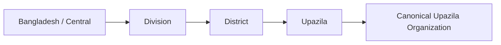
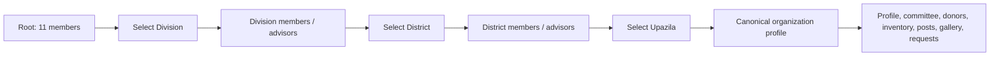
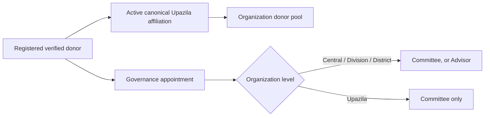
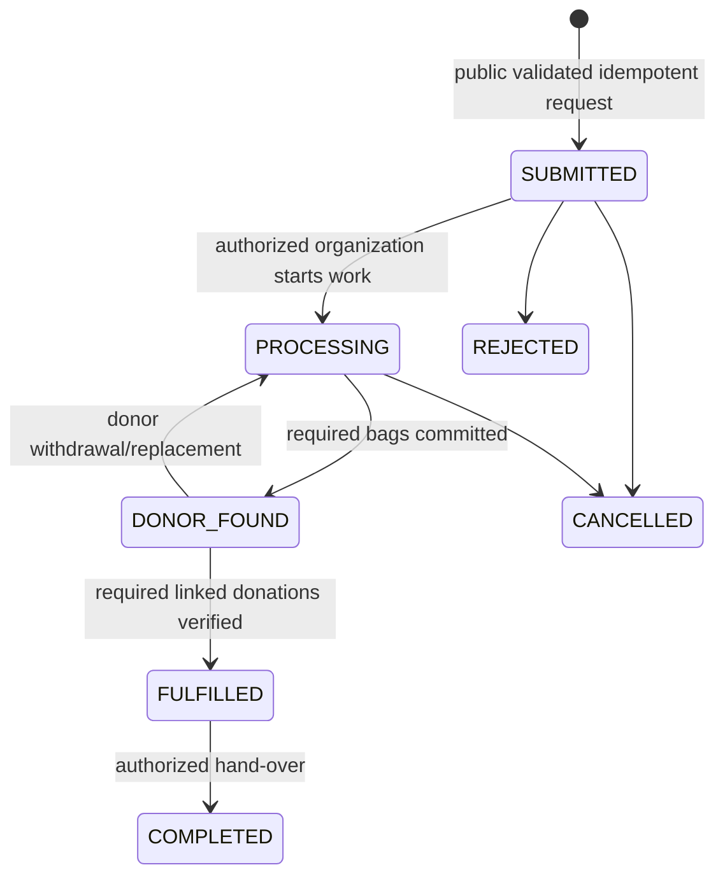
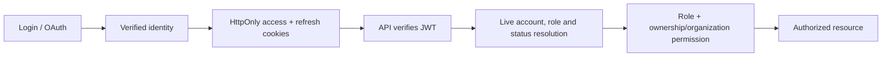
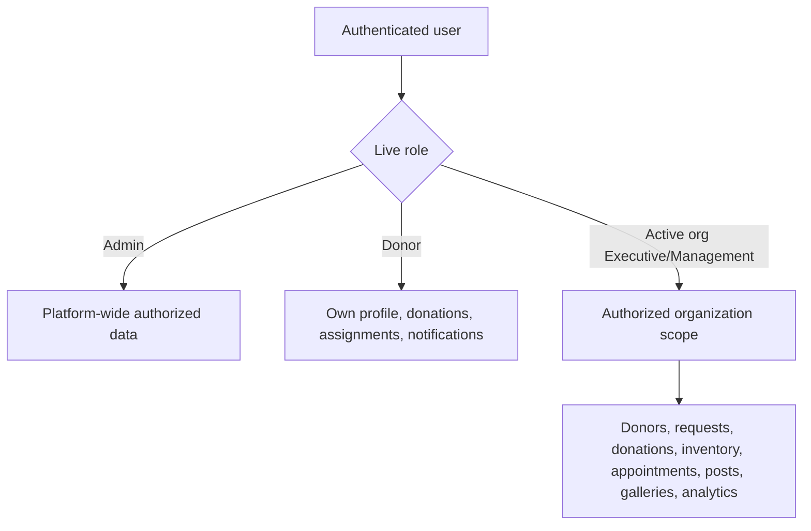

# BD Blood Implemented Workflows

This document describes verified repository behavior as of the finalization audit. It is updated alongside implementation changes.

## Geography and organization hierarchy

Canonical organizations form a parallel navigable tree (`CENTRAL → DIVISION → DISTRICT → UPAZILA`). Donor affiliation points to the canonical Upazila organization; governance membership represents committee responsibility and is not ordinary donor affiliation.

## Public organization navigation

Root has committee members only. Division and District expose independent Committee and Advisor categories. Upazila exposes Committee only and redirects to the full organization profile.

## Membership

Governance appointments reference existing active, verified donors. Category caps are 11 and are serialized transactionally. Dashboard access requires an active Executive or Management position in the requested organization, with Admin as the platform-wide superset.

## Blood request lifecycle

Creation validates geographic ancestry and resolves exactly one canonical Upazila organization. Processing creates donor assignments for eligible donors in the authoritative affiliation. Acceptance revalidates donor status, blood group, affiliation, cooldown and capacity under a request row lock. Verification atomically updates the assignment, request aggregate, donor cooldown, achievements and post eligibility. SMS is written to a durable outbox and delivered by the worker.

## Authentication and authorization

Frontend route guards improve navigation only. Every sensitive API route performs backend authentication and services enforce ownership or organization jurisdiction.

## Dashboard data access

Client-supplied organization IDs are identifiers, not authority. The API resolves current membership and checks the target row's organization before reading or mutating scoped data.

