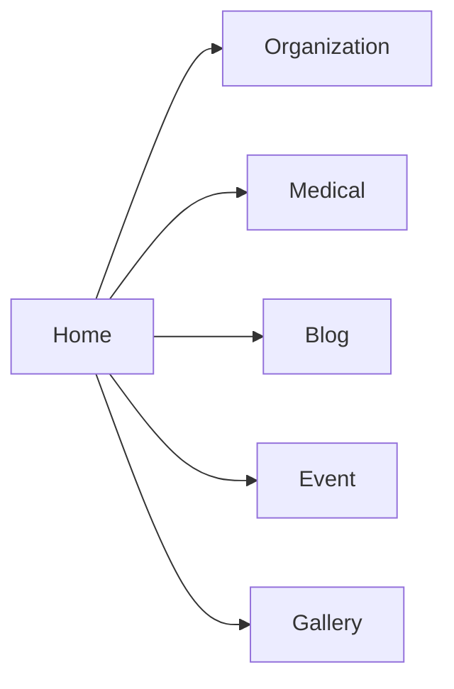
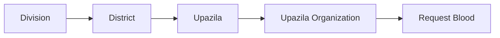
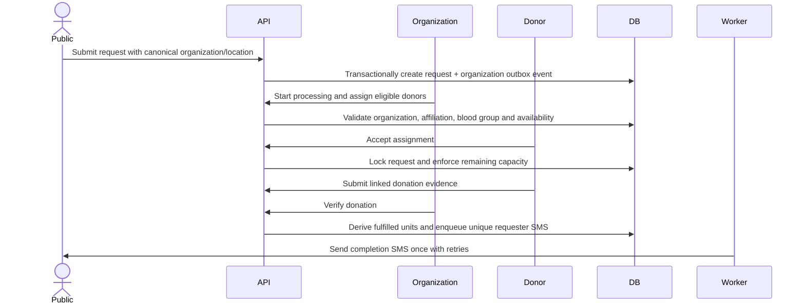
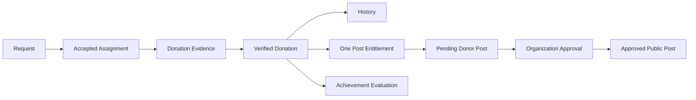
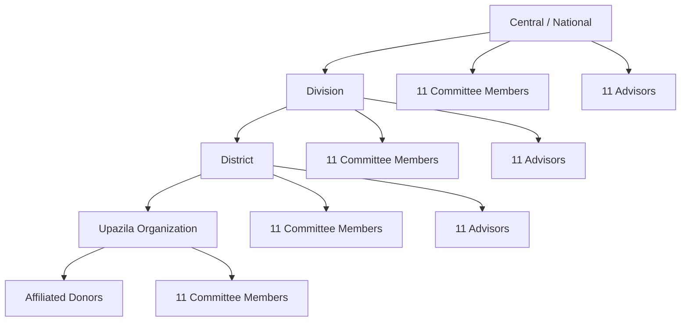
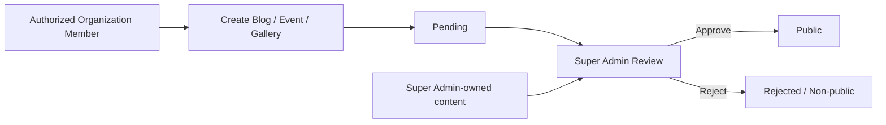
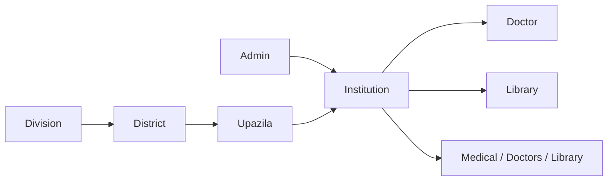
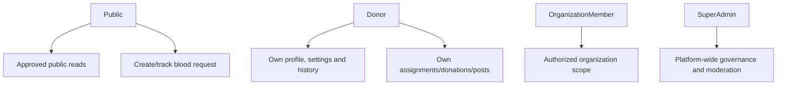

# BD Blood Workflow

This document records the verified target architecture after comparing the new specification with the existing implementation.

## Public

Public APIs expose only active/verified organizations and approved/published content. Internal hierarchy explanations are not public UI.

## Need Blood

Changing a parent clears dependent selections. Upazila selection resolves one canonical `UPAZILA` organization before navigation.

## Blood Request

## Donation

Each assignment represents one bag and can link to at most one donation. Each verified donation can link to at most one post.

## Organization Hierarchy

Advisors are governance records but do not receive Organization dashboard access unless the confirmed authorization model is intentionally changed. Upazila advisors are not part of the target workflow.

## Content Moderation

Ownership and reviewer metadata are server-derived. Organization users cannot approve their own content by changing request payloads.

## Medical

The API validates geographic ancestry and public Library reads expose published articles only.

## Roles

Client-provided user, donor, organization, ownership, role and approval fields are identifiers or input only; the API resolves authority from the authenticated account and database relationships.

## Donor Sharing Card

The donor dashboard generates a client-side social image from same-origin/loaded profile media, name, BD Blood branding and verified donation/achievement context. Download uses an image blob. Share uses the Web Share API with file support when available and falls back to download/link sharing; it does not claim automatic Facebook publishing.

## Removed Workflow

Booking Donation / Donation Appointments are not part of BD Blood. The public organization profile routes users to Request Blood only; donation verification originates from accepted request assignments.

