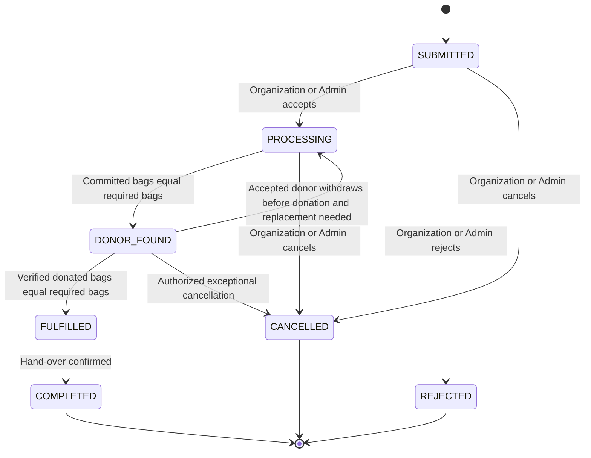
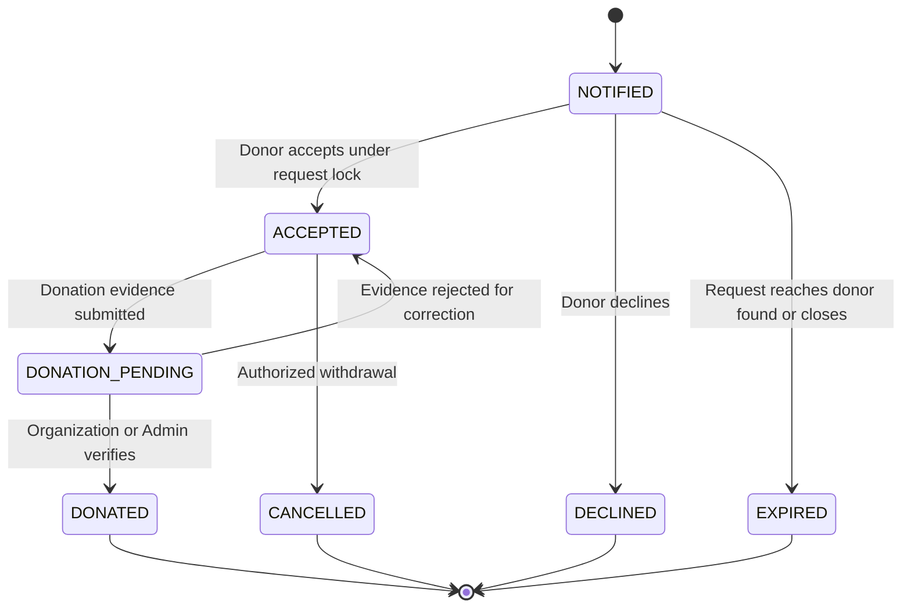

# BD Blood System Implementation Plan

## 1. Objective and confirmed semantics

This plan aligns the existing Express, Prisma, PostgreSQL, Redis, Socket.IO, and Next.js implementation with the approved business rules.

Confirmed semantics:

- A donor can commit exactly one bag to a request.
- All required bags committed moves a request to DONOR_FOUND.
- All committed bags backed by verified donations moves a request to FULFILLED.
- Organization or Admin hand-over confirmation moves a request to COMPLETED.
- Donors enter a three-calendar-month cooldown only after donation verification.
- A verified donation grants personal donation-post eligibility.
- Central, Division, and District scopes each support up to 11 committee members and 11 advisors.
- Upazila scopes support up to 11 committee members total and no advisor seats.
- Ordinary donor affiliation is separate from committee or advisor membership.
- Admin can perform every organization-management action, with broader cross-organization scope.

## 2. Current implementation audit

### 2.1 Foundations that should be retained

- Email verification is mandatory for non-admin login in [`login()`](apps/api/src/app/modules/auth/auth.service.ts:25) and authenticated requests in [`auth()`](apps/api/src/app/middlewares/auth.ts:49).
- Email and phone OTP flows already use expiry, retry protection, and Redis-backed grants through [`AuthService`](apps/api/src/app/modules/auth/auth.service.ts:683).
- Phone verification is represented by [`Donor.phoneVerifiedAt`](apps/api/prisma/schema/schema.prisma:110), and the frontend displays its state in [`PhoneVerificationSection`](apps/web/src/components/modules/Donor/Profile/PhoneVerificationSection.tsx:19).
- Public request submission exists in [`RequestBloodForm`](apps/web/src/components/modules/Organization/PublicOrganizationProfile/RequestBloodForm.tsx:55) and is rate-limited in [`bloodRequest.routes.ts`](apps/api/src/app/modules/bloodRequest/bloodRequest.routes.ts:16).
- Donor acceptance serializes concurrent responses with a PostgreSQL row lock in [`respondToAssignment()`](apps/api/src/app/modules/bloodRequest/bloodRequest.service.ts:723).
- Donation cooldown fields already exist on [`Donor`](apps/api/prisma/schema/schema.prisma:81), and cooldown restoration is idempotent in [`sweepDonorAvailability()`](apps/api/src/app/jobs/donorAvailabilitySweeper.ts:6).
- Achievement definitions and donor unlocks are database-driven through [`Achievement`](apps/api/prisma/schema/schema.prisma:814) and [`DonorAchievement`](apps/api/prisma/schema/schema.prisma:836).
- Personal donation posts currently require at least one verified donation in [`createPost()`](apps/api/src/app/modules/post/post.service.ts:58).
- Request status history already exists in [`BloodRequestStatusHistory`](apps/api/prisma/schema/schema.prisma:403).
- Admin bypass for organization access is consistently established in [`orgAccess.ts`](apps/api/src/app/middlewares/orgAccess.ts:47).

### 2.2 Critical gaps and conflicts

1. **Donor affiliation is conflated with governance membership.** Automatic Upazila assignment creates a Normal Donor [`OrganizationMember`](apps/api/src/app/modules/user/user.service.ts:275). The same table is also used for capped committee and advisor seats. This prevents a clean unlimited-donor versus capped-leadership model.

2. **The organization geographic model is denormalized and ambiguous.** Every [`Organization`](apps/api/prisma/schema/schema.prisma:197) requires Division, District, and Upazila IDs even for Central, Division, and District organizations. Type is a free-form string, and there is no parent relation or database uniqueness for one organization per geographic scope.

3. **Request routing is inventory-dependent.** [`createRequest()`](apps/api/src/app/modules/bloodRequest/bloodRequest.service.ts:151) notifies organizations only when matching inventory exists or an organization is supplied. The target rule requires canonical routing by selected Upazila regardless of inventory.

4. **Donors are notified too early.** Request creation immediately calls [`dispatchBloodRequestDonorAlerts()`](apps/api/src/app/helper/bloodRequestDonorAlert.ts:11), before organization acceptance or handling.

5. **Acceptance is incorrectly treated as fulfillment.** [`respondToAssignment()`](apps/api/src/app/modules/bloodRequest/bloodRequest.service.ts:723) changes the request to FULFILLED when enough donors accept, sends requester SMS, and cancels pending assignments. The target state at that point is DONOR_FOUND.

6. **Verified donation does not advance the linked request.** [`verifyDonation()`](apps/api/src/app/modules/bloodDonation/bloodDonation.service.ts:217) updates cooldown and achievements but does not atomically mark the assignment donated or recompute request fulfillment.

7. **Donation linkage is too permissive.** [`createDonation()`](apps/api/src/app/modules/bloodDonation/bloodDonation.service.ts:33) verifies assignment ownership only. It does not require ACCEPTED status, prevent multiple donations per assignment, derive request location and organization, or enforce donor eligibility.

8. **Manual status mutation bypasses the state machine.** [`updateRequestStatus()`](apps/api/src/app/modules/bloodRequest/bloodRequest.service.ts:308) permits arbitrary enum changes and can manually mark a request fulfilled. It also deducts inventory separately from actual donations.

9. **Profile completion has no authoritative state or guard.** Nullable location fields exist on [`Donor`](apps/api/prisma/schema/schema.prisma:81), but protected operations do not share a profile-completion policy and the frontend has no mandatory completion modal flow.

10. **Committee caps are application checks vulnerable to races.** [`assertLeadershipCapacityAvailable()`](apps/api/src/app/modules/organizationMember/organizationMember.service.ts:312) counts before insert without locking a scope row. Concurrent appointments can exceed the cap.

11. **Post eligibility is donor-wide rather than donation-specific.** A donor with any historical verified donation can create unlimited personal donation posts. The approved rule is better represented by a verified donation eligibility grant, normally consumed by one donation recap post.

12. **Asynchronous SMS is not durable.** Request and donor SMS use fire-and-forget promises in [`bloodRequest.service.ts`](apps/api/src/app/modules/bloodRequest/bloodRequest.service.ts:236). There is no outbox, retry schedule, idempotency key, or requester delivery audit.

13. **Public data exposure is excessive.** Public donor responses omit passwords but can still expose phone and operational fields through [`getPublicDonors()`](apps/api/src/app/modules/user/user.service.ts:535). Public request list and detail routes are also unrestricted in [`bloodRequest.routes.ts`](apps/api/src/app/modules/bloodRequest/bloodRequest.routes.ts:23).

14. **Admin and organization verification differ.** Only Admin can verify donations in [`bloodDonation.routes.ts`](apps/api/src/app/modules/bloodDonation/bloodDonation.routes.ts:37), although approved requirements grant organizations equivalent request-management capabilities within jurisdiction.

15. **In-process sweepers are deployment-sensitive.** [`startDonorAvailabilitySweeper()`](apps/api/src/app/jobs/donorAvailabilitySweeper.ts:58) runs in every API replica and does not run when no API process is alive. Its query is safe, but production scheduling and observability need strengthening.

## 3. Target domain model

### 3.1 Organization hierarchy

Replace geographic ambiguity with explicit scope fields.

#### Organization changes

Add:

- level: CENTRAL, DIVISION, DISTRICT, UPAZILA
- parentId: nullable self-reference
- divisionId: nullable
- districtId: nullable
- upazilaId: nullable
- canonical: boolean, default true for geographic organizations

Constraints:

- CENTRAL has no geographic foreign key and no parent.
- DIVISION has divisionId and parent CENTRAL.
- DISTRICT has districtId and parent matching its Division organization.
- UPAZILA has upazilaId and parent matching its District organization.
- One active canonical organization per scope using partial unique indexes:
  - one CENTRAL organization
  - one canonical organization per divisionId at DIVISION level
  - one canonical organization per districtId at DISTRICT level
  - one canonical organization per upazilaId at UPAZILA level
- Retire free-form type after data migration.

#### Donor affiliation

Add a dedicated [`DonorOrganizationAffiliation`](apps/api/prisma/schema/schema.prisma) model:

- id
- donorId, unique for primary-affiliation semantics
- organizationId
- upazilaId
- assignedAt
- source: PROFILE, ADMIN, MIGRATION
- active
- createdAt and updatedAt

This relation is unlimited and has no position. Updating a donor Upazila atomically moves this affiliation to the canonical Upazila organization. Committee appointments no longer affect donor affiliation.

#### Governance membership

Keep and refine [`OrganizationMember`](apps/api/prisma/schema/schema.prisma:252) exclusively for governance:

- organizationId becomes required, including Central membership through a real Central organization.
- Add category: COMMITTEE or ADVISOR.
- Keep positionId for titles and ordering.
- Add appointedById, activatedAt, endedAt, and status.
- Remove the global unique donorId constraint. Use one active membership per donor per organization/category with a partial unique index.
- Permit a donor to hold governance positions at different hierarchy levels if policy later allows it.

Capacity rules:

| Organization level | Committee cap | Advisor cap |
|---|---:|---:|
| Central | 11 | 11 |
| Division | 11 | 11 |
| District | 11 | 11 |
| Upazila | 11 | 0 |

Capacity enforcement must lock the target Organization row inside the same transaction, count active category seats, validate the level/category cap, then insert or activate membership. The service check provides a clear 409 response; row locking makes it concurrency-safe.

### 3.2 Donor onboarding and profile readiness

Add to [`Donor`](apps/api/prisma/schema/schema.prisma:81):

- profileStatus: INCOMPLETE or COMPLETE
- profileCompletedAt: nullable
- optional availabilityPreference if donors need a manual opt-out separate from medical cooldown

Keep:

- isVerified and verifiedAt for email verification
- phoneVerifiedAt for phone verification
- lastDonationDate
- nextEligibleDonationDate
- availabilityStatus

Define one server-side profile policy in a shared service rather than trusting a stored flag alone. Minimum completion fields:

- full name
- normalized phone
- blood group
- Division, District, and Upazila with valid ancestry
- email verified
- canonical Upazila organization affiliation present

Phone verification remains a separate trust signal and is not required for profile completion unless policy changes. Changing a verified phone clears phoneVerifiedAt until the new number is verified.

Add middleware or service assertion [`assertDonorOperationallyReady()`](apps/api/src/app/middlewares) that checks:

- active, non-deleted account
- email verified
- profile complete
- primary affiliation exists
- phone verified only for operations explicitly configured to require it

Apply it to assignment acceptance/rejection, donation creation, donor personal-post creation, and organization membership applications. Admin bypasses donor-profile requirements only for administrative actions, never when acting as a donor.

### 3.3 Blood request and assignment data

#### BloodRequest changes

Add:

- referenceCode: unique, human-readable, immutable
- handledByOrganizationId: required after routing and ideally required at creation
- acceptedById: nullable
- acceptedAt: nullable
- donorFoundAt: nullable
- fulfilledAt: nullable
- handoverCompletedAt: nullable
- completedById: nullable
- rejectedAt and rejectedById
- cancellationReason and rejectionReason
- version: integer for optimistic client refresh if needed

Use the approved status enum:

- SUBMITTED
- PROCESSING
- DONOR_FOUND
- FULFILLED
- COMPLETED
- CANCELLED
- REJECTED

Do not store mutable accepted or fulfilled counters initially. Compute them transactionally from assignments and verified donations, and return them in a summary. If scale later requires counters, add them as transactionally maintained projections with reconciliation.

Database checks:

- requiredUnits greater than zero
- terminal timestamps correspond to statuses where practical
- location ancestry is validated in service transaction

#### RequestAssignment changes

Use statuses:

- NOTIFIED
- ACCEPTED
- DECLINED
- EXPIRED
- CANCELLED
- DONATION_PENDING
- DONATED

Fields:

- requestId
- donorId
- assignedById
- status
- bagUnits fixed to 1 with a database check
- notifiedAt
- acceptedAt
- declinedAt
- cancelledAt
- donationSubmittedAt
- donatedAt
- declineReason

Constraints:

- unique requestId and donorId
- bagUnits equals 1
- one donation per assignment through a unique requestAssignmentId on BloodDonation

Only ACCEPTED and DONATION_PENDING count as committed before verification. DONATED remains committed and also fulfilled.

#### BloodDonation changes

Make requestAssignmentId unique when present. For request-linked donations:

- donor, request, organization, blood group, and location are derived server-side from the accepted assignment.
- verification can be performed by Admin or an authorized manager of handledByOrganizationId.
- verification transitions the assignment to DONATED and recomputes request state in one transaction.

Allow independent donation records only as a separate explicit workflow if still required. Prefer an endpoint and validation schema that clearly distinguishes independent history from request fulfillment.

### 3.4 Post eligibility

Add [`DonationPostGrant`](apps/api/prisma/schema/schema.prisma) or link [`Post`](apps/api/prisma/schema/schema.prisma:446) directly to a verified donation.

Recommended model:

- Add donationId nullable and unique to Post for personal RECAP or DONATION posts.
- Personal donation post creation requires a verified donation owned by the donor and no existing active personal post linked to it.
- Organization broadcast posts do not require a donation, but require Admin or authorized organization manager access.
- Store eligibility as derived data from a verified, unconsumed donation rather than a mutable boolean.

This creates auditable, one-donation-to-one-recap eligibility and prevents fake or repeated claims.

### 3.5 Durable communications

Add [`MessageOutbox`](apps/api/prisma/schema/schema.prisma):

- id
- channel: SMS, IN_APP, EMAIL
- templateKey
- recipient
- payload JSON
- aggregateType and aggregateId
- eventKey unique for idempotency
- status: PENDING, PROCESSING, SENT, FAILED, DEAD
- attempts
- nextAttemptAt
- providerMessageId
- lastError
- sentAt
- createdAt and updatedAt

Write outbox records in the same transaction as business transitions. A worker claims rows with skip-locked semantics, sends messages, records results, and retries with backoff.

Requester SMS events:

- request submitted acknowledgement, optional
- processing started, optional
- donor found when all bags are committed
- fulfilled when every required donation is verified; this is the required success SMS
- completed hand-over, optional
- cancelled or rejected

The FULFILLED SMS payload must include reference code, blood group, required and fulfilled bags, Division/District/Upazila, hospital or patient information, and the representative follow-up statement.

## 4. State machines and invariants

### 4.1 Request state machine

Rules:

- Request creation always routes to exactly one canonical Upazila organization and starts SUBMITTED.
- Donors are not notified until SUBMITTED transitions to PROCESSING.
- Committed bags never exceed requiredUnits.
- Verified donated bags never exceed committed bags or requiredUnits.
- DONOR_FOUND disables all remaining NOTIFIED assignments by changing them to EXPIRED or CANCELLED in the same transaction.
- A replacement flow may return DONOR_FOUND to PROCESSING only when a committed donor withdraws before donation verification.
- FULFILLED cannot be set manually; it is derived by verified linked donations.
- COMPLETED requires FULFILLED and explicit hand-over confirmation.
- Terminal states reject further donor actions.

### 4.2 Assignment state machine

### 4.3 Donation and cooldown invariants

- Only verified donation triggers cooldown, achievements, post eligibility, and request fulfilled-unit progression.
- Verification is idempotent. Re-verifying VERIFIED makes no duplicate achievements, messages, or state transitions.
- Rejecting or deleting an already verified donation requires a dedicated reversal workflow. It must recalculate donor last donation, next eligibility, achievements if revocable, assignment state, and request state; ordinary update and delete endpoints must not do this.
- nextEligibleDonationDate equals donationDate plus three calendar months.
- Eligibility checks should use nextEligibleDonationDate as authoritative at request time, even if the sweeper has not yet updated the projection status.

### 4.4 Atomic donor acceptance algorithm

Inside one database transaction:

1. Resolve authenticated donor and assert operational readiness.
2. Lock the BloodRequest row using SELECT FOR UPDATE.
3. Reload request and assignment.
4. Require request PROCESSING and assignment NOTIFIED.
5. Require donor email verified, profile complete, blood-group match, active account, and current donation eligibility.
6. Count assignments in ACCEPTED, DONATION_PENDING, and DONATED.
7. Reject with 409 REQUEST_CAPACITY_REACHED if committed count is already requiredUnits.
8. Update this assignment to ACCEPTED.
9. Recount committed assignments.
10. If count equals requiredUnits, move request to DONOR_FOUND, add history, expire all remaining NOTIFIED assignments, mark their actionable notifications inactive/read, and enqueue requester and donor messages.
11. Commit and emit real-time events after commit.

The row lock serializes all acceptance attempts for one request and enforces the cap even under simultaneous requests.

### 4.5 Atomic donation verification algorithm

Inside one database transaction:

1. Authorize Admin or manager of handledByOrganizationId.
2. Lock the BloodRequest row and donation row.
3. Require donation PENDING and assignment DONATION_PENDING or ACCEPTED.
4. Mark donation VERIFIED and assignment DONATED.
5. Update donor lastDonationDate, nextEligibleDonationDate, and UNAVAILABLE projection.
6. Upsert newly reached achievements.
7. Count DONATED assignments for the request.
8. If donated count equals requiredUnits, move DONOR_FOUND to FULFILLED, add history, and enqueue the required requester SMS.
9. Commit, then emit Socket.IO updates.

## 5. API contracts

Use a consistent envelope with success, message, data, meta when paginated, and error containing code and field details. Mutating endpoints should accept an Idempotency-Key header for public request submission and critical transition commands.

### 5.1 Public requests

#### POST /blood-requests

Authentication: public.

Request:

- requesterName
- requesterPhone in accepted Bangladesh format
- bloodGroupId
- requiredUnits
- patientName if separated from requester
- hospitalName
- patientDetails or message
- divisionId
- districtId
- upazilaId
- requestType

Server behavior:

- Validate geographic ancestry.
- Resolve canonical Upazila organization; return 422 ORGANIZATION_NOT_CONFIGURED when absent.
- Ignore or reject client-supplied organizationId to prevent jurisdiction spoofing.
- Normalize phone.
- Create request, initial history, and optional submitted SMS outbox atomically.

Response: request referenceCode, SUBMITTED status, routed organization public identity, createdAt, and tracking-safe summary. Do not echo sensitive operational data unnecessarily.

#### GET /blood-requests/track/:referenceCode

Public but protected with reference code plus normalized requester phone suffix or signed tracking token.

Returns status timeline and bag summary without donor identities or private organization details.

Remove unrestricted public access to full request listings and details. Admin and organization lists become authenticated and jurisdiction-scoped.

### 5.2 Organization and Admin request commands

- GET /blood-requests with scoped filters and pagination
- GET /blood-requests/:id with authorization and timeline
- POST /blood-requests/:id/start-processing
- POST /blood-requests/:id/reject with reason
- POST /blood-requests/:id/cancel with reason
- POST /blood-requests/:id/dispatch-donors
- POST /blood-requests/:id/complete-handover
- GET /blood-requests/:id/eligible-donors
- GET /blood-requests/:id/assignments

Do not retain a general arbitrary status patch endpoint. Expose command endpoints so each transition has dedicated validation, authorization, effects, and audit text.

Organization scope is handledByOrganizationId. Admin may operate on all requests. Organization managers only operate on their own organization requests.

### 5.3 Donor assignment commands

- GET /donor/request-assignments with status filters and pagination
- GET /donor/request-assignments/:id
- POST /donor/request-assignments/:id/accept
- POST /donor/request-assignments/:id/decline with optional reason
- POST /donor/request-assignments/:id/withdraw with reason and policy checks

Acceptance response includes request status, requiredBags, committedBags, fulfilledBags, remainingCommitmentBags, and whether further acceptance is closed.

Expected conflict codes:

- PROFILE_INCOMPLETE
- EMAIL_NOT_VERIFIED
- DONOR_NOT_ELIGIBLE
- ASSIGNMENT_NOT_ACTIONABLE
- REQUEST_CAPACITY_REACHED
- REQUEST_CLOSED

### 5.4 Donation commands

- POST /donor/request-assignments/:id/donation to submit evidence or details for that accepted assignment
- GET /donor/donations
- GET /organizations/:organizationId/donations with scoped statuses
- POST /blood-donations/:id/verify
- POST /blood-donations/:id/reject with reason
- POST /blood-donations/:id/reverse as Admin-only exceptional correction with full audit

Request-linked donation submission should not accept donorId, organizationId, blood group, or geographic IDs from the client.

### 5.5 Profile and verification

- GET /users/me returns profileStatus, missingProfileFields, emailVerified, phoneVerified, affiliation, cooldown, and capabilities.
- PATCH /users/me/profile validates geographic ancestry and synchronizes affiliation atomically.
- POST /auth/send-phone-otp
- POST /auth/verify-phone-otp
- Email verification endpoints remain.

Capability flags should be server-derived:

- canAcceptBloodRequests
- canSubmitDonation
- canCreateDonationPost
- canAccessOrganizationDashboard
- nextEligibleDonationAt

The frontend uses these for UX, while backend guards remain authoritative.

### 5.6 Governance and organizations

- GET /organizations/tree returns Central to Division to District to Upazila hierarchy.
- GET /organizations/by-upazila/:upazilaId resolves the canonical organization.
- GET /organizations/:id/donors lists affiliations separately from governance.
- GET /organizations/:id/members lists committee and advisors.
- POST /organizations/:id/members appoints a donor with category and position.
- PATCH /organizations/:id/members/:memberId updates status or position under a lock.
- DELETE /organizations/:id/members/:memberId ends membership.

Remove ordinary donor join/leave from governance membership. Donor affiliation follows profile location automatically.

### 5.7 Posts and achievements

- GET /donor/post-eligibility returns verified donations without personal recap posts.
- POST /posts personal payload includes donationId and personal post type.
- Organization post creation requires explicit organization context and manager permission.
- Existing achievement CRUD remains Admin-only.
- Achievement recalculation command may be added for migrations and repair.

## 6. Permission matrix

| Capability | Public | Donor | Organization manager | Admin |
|---|---:|---:|---:|---:|
| Submit blood request | Yes | Yes | Yes | Yes |
| Track own request with token | Yes | Yes | Yes | Yes |
| View all request details | No | Assigned only | Own jurisdiction | All |
| Start processing and notify donors | No | No | Own jurisdiction | All |
| Reject or cancel request | No | No | Own jurisdiction | All |
| Accept or decline assignment | No | Own assignment | Own assignment if also donor | Own assignment if acting as donor |
| Submit donation | No | Own accepted assignment | Own accepted assignment | Administrative independent entry only |
| Verify linked donation | No | No | Own jurisdiction | All |
| Confirm hand-over | No | No | Own jurisdiction | All |
| View affiliated donor directory | Public-safe fields only | Public-safe fields | Own organization operational fields | All |
| Appoint committee members | No | No | Own organization within delegated policy | All |
| Create personal donation post | No | With unused verified donation | Same donor rule | Same donor rule when personal |
| Create organization broadcast post | No | No | Own organization | All |
| Manage achievements | No | No | No | All |

Organization manager means an ACTIVE governance member whose position grants request-management capability. Replace broad position-level assumptions over time with explicit permission codes such as REQUEST_MANAGE, DONATION_VERIFY, MEMBER_MANAGE, POST_MODERATE, and INVENTORY_MANAGE. Initially map EXECUTIVE and MANAGEMENT positions to these capabilities to preserve behavior.

## 7. Frontend plan

### 7.1 Onboarding gate

- Extend [`User`](apps/web/src/redux/features/auth/auth.types.ts:1) with profileStatus, missingProfileFields, affiliation, capability flags, and verification flags.
- Add a non-dismissible profile completion modal at the private dashboard root when profileStatus is INCOMPLETE.
- Reuse the cascading location patterns from [`RequestBloodForm`](apps/web/src/components/modules/Organization/PublicOrganizationProfile/RequestBloodForm.tsx:55) or the shared location hook.
- On save, refresh the session/profile and show the assigned Upazila organization.
- Protected buttons display the exact blocking reason from capability data.

### 7.2 Request submission and tracking

- Keep the public form but remove organizationId from the ordinary public payload.
- Add stronger phone normalization and maximum required-unit validation consistent with API policy.
- Show reference code and tracking token after submission.
- Add a public tracking page with the request timeline and bag progress.

### 7.3 Organization request dashboard

- Replace generic status dropdowns with allowed command buttons based on current state.
- Display required, committed, verified, and remaining bags separately.
- Show assignments grouped by NOTIFIED, ACCEPTED, DONATION_PENDING, DONATED, and inactive states.
- Disable or remove dispatch once the request is DONOR_FOUND or later.
- Add donation verification and final hand-over controls.

### 7.4 Donor notification UX

Update [`bloodRequestsApi`](apps/web/src/redux/features/bloodRequests/bloodRequestsApi.ts:91) types and endpoints.

- Accept button is actionable only for NOTIFIED assignment and PROCESSING request.
- On 409 capacity reached, refresh request/notification and render Already arranged.
- DONOR_FOUND and later statuses disable all remaining donor actions.
- After acceptance, guide donor to submit donation information rather than showing the request as fulfilled.
- Socket.IO request-state events should invalidate request assignment and notification tags.

### 7.5 Donor profile and posts

- Preserve phone verification badge and cooldown countdown.
- Hide actual phone on public profiles; expose only phoneVerified boolean or badge.
- Add achievement list from the existing API.
- Personal post composer requires selecting one eligible verified donation.

### 7.6 Organization hierarchy UI

- Render canonical Central, Division, District, and Upazila nodes from the hierarchy API.
- Separate Donors, Committee, and Advisors views.
- Upazila UI must not offer Advisor appointments.
- Capacity indicators show occupied versus allowed seats, but backend remains authoritative.

## 8. Migration and rollout strategy

### Phase 0: Safety baseline

- Add integration-test infrastructure for PostgreSQL and Redis; the API currently has no test suite in [`apps/api/package.json`](apps/api/package.json:10).
- Capture production counts and anomalies: organizations by type/location, Normal Donor memberships, duplicate organizations per Upazila, accepted assignments, fulfilled requests without verified donations, duplicate assignment-linked donations, and invalid geo ancestry.
- Back up the database and rehearse migration against a sanitized snapshot.
- Add feature flags for new request state machine, affiliation reads, durable outbox, and profile gate.

### Phase 1: Additive schema migration

- Add explicit organization level, parent, canonical marker, and nullable scope foreign keys without dropping legacy columns.
- Create DonorOrganizationAffiliation.
- Add profileStatus and profileCompletedAt.
- Add new request timestamps, referenceCode, handledByOrganizationId, and expanded enum values.
- Add assignment bagUnits and expanded statuses.
- Add unique requestAssignmentId index after cleaning duplicates.
- Add Post donationId and MessageOutbox.
- Add required indexes for matching, scoped dashboards, outbox claims, and timelines.
- Add check constraints and partial unique indexes through SQL migrations where Prisma cannot express them.

### Phase 2: Organization and affiliation backfill

1. Normalize existing free-form organization types into levels.
2. Create a real Central organization.
3. Resolve one canonical organization for every Division, District, and Upazila represented by geo data. Prefer existing verified active organizations; flag collisions for Admin review.
4. Set parent relations from geographic ancestry.
5. Convert every active Normal Donor OrganizationMember into DonorOrganizationAffiliation.
6. Also backfill affiliation from donor.upazilaId when no Normal Donor row exists.
7. Preserve genuine EXECUTIVE and MANAGEMENT memberships as governance members; map EXECUTIVE to COMMITTEE and MANAGEMENT to ADVISOR except Upazila MANAGEMENT records, which require explicit review or committee remapping.
8. Validate caps. Do not silently delete excess records; mark excess appointments pending review and export a report.
9. Dual-read affiliation from new relation first and legacy Normal Donor membership as fallback during rollout.

### Phase 3: Profile readiness backfill

- Mark COMPLETE only when required fields, valid geographic ancestry, verified email, and affiliation are present.
- Mark all other donors INCOMPLETE and compute missing fields at read time.
- Changing Upazila writes both donor location and new affiliation during dual-write period.
- Update public donor queries to require profile COMPLETE and return an explicit safe field projection.

### Phase 4: Request lifecycle backfill

Map old statuses conservatively:

| Old status | New status rule |
|---|---|
| PENDING | SUBMITTED unless dispatch evidence exists, then PROCESSING |
| PROCESSING | DONOR_FOUND if accepted commitments meet required units; otherwise PROCESSING |
| FULFILLED | FULFILLED only if verified linked donations meet required units; otherwise DONOR_FOUND when commitments meet units, else PROCESSING |
| CANCELLED | CANCELLED |
| REJECTED | REJECTED |

Additional steps:

- Generate immutable reference codes for all requests.
- Set handledByOrganizationId from existing organizationId, earliest notification, or canonical Upazila organization in that order.
- Convert assignment PENDING to NOTIFIED, REJECTED to DECLINED, and retain ACCEPTED.
- Link donations to assignments only when donor, request context, and dates provide an unambiguous match; produce a manual-review list otherwise.
- Do not send historical SMS during backfill. Mark migration-created outbox events as suppressed.
- Write migration history entries indicating automated status normalization.

### Phase 5: Service and API cutover

- Introduce command-oriented request services and shared transition guards.
- Stop donor alerts at request creation; enqueue only organization acknowledgement.
- Route every new request to canonical Upazila organization.
- Enable row-locked donor acceptance and row-locked governance capacity checks.
- Make donation verification advance assignment and request states.
- Start writing durable outbox events.
- Serve legacy endpoints as adapters where frontend cutover requires it, but reject illegal arbitrary transitions.

### Phase 6: Frontend cutover

- Deploy updated profile gate, contracts, state labels, dashboards, tracking, and post eligibility.
- Enable capability-based UI.
- Monitor 409 transition conflicts and profile-blocking rates.
- Remove legacy client status patch usage after all pages use command endpoints.

### Phase 7: Cleanup migration

After parity checks and a stable observation window:

- Remove Normal Donor position and legacy affiliation membership rows.
- Make governance organizationId required.
- Remove Organization free-form type and obsolete mandatory geo columns once level-specific constraints are active.
- Remove old BloodRequest status values and legacy adapter endpoints.
- Remove dual writes and fallback reads.
- Remove any redundant request organization notification table behavior replaced by outbox and direct handling organization.

## 9. Testing strategy

### 9.1 Unit tests

- Geographic ancestry and canonical organization resolution.
- Profile readiness and capability computation.
- Allowed request and assignment transitions.
- Committee and advisor cap policy by organization level.
- SMS template rendering and Bangladesh phone normalization.
- Achievement threshold selection.
- Post eligibility from verified, unused donations.

### 9.2 Transactional integration tests

Use real PostgreSQL because row locks and partial indexes cannot be validated with mocks.

Required concurrency cases:

1. Required bags 3 with 20 simultaneous donor acceptance requests results in exactly 3 ACCEPTED commitments.
2. Remaining assignments become EXPIRED and cannot accept afterward.
3. Duplicate acceptance from one donor is idempotent or returns deterministic conflict.
4. Two simultaneous verification calls for one donation produce one cooldown update, one set of achievement unlocks, and one requester SMS outbox event.
5. Third verified donation changes DONOR_FOUND to FULFILLED only once.
6. Two simultaneous appointments for the final committee seat result in one success and one 409.
7. Upazila advisor appointment is rejected.
8. Changing donor Upazila atomically changes affiliation without changing governance appointments.
9. A request submitted to an Upazila without a canonical organization fails without creating a partial request.
10. SMS provider failure leaves a retryable outbox row without rolling back fulfillment.

### 9.3 Authorization tests

- Ordinary donor cannot access organization request management.
- Organization manager cannot manage another organization request or donation.
- Admin can perform every organization action across scopes.
- A SUPPORT or ordinary affiliated donor cannot gain dashboard access.
- Public tracking does not reveal requester full phone or donor identities.
- Public donor profile never returns actual phone, email, password, notification preferences, or internal status fields.

### 9.4 End-to-end scenarios

- Public request for 3 bags routes to selected Upazila organization, starts processing, notifies eligible donors, accepts exactly 3, verifies three donations, sends fulfilled SMS, and completes hand-over.
- New verified donor is forced through profile completion, assigned to canonical organization, verifies phone independently, and becomes eligible for matching.
- Verified donation starts cooldown, unlocks achievement, enables one recap post, and returns donor to available after eligibility date.
- Donor D opens a stale notification after DONOR_FOUND and sees a disabled action with Already arranged.

## 10. Observability and operations

Add structured audit and metrics:

- requests created by Upazila and route-resolution failures
- time from SUBMITTED to PROCESSING, DONOR_FOUND, FULFILLED, and COMPLETED
- committed and verified bag deficits
- assignment notifications, accepts, declines, expirations, and capacity conflicts
- donation verification and rejection counts
- cooldown restorations and overdue projection mismatches
- outbox pending depth, attempts, send latency, failures, and dead letters
- organization seat occupancy and cap conflicts
- profile completion funnel and blocking reasons

Log identifiers, not sensitive patient messages or full phone numbers. Include requestId, referenceCode, organizationId, assignmentId, donationId, actorId, transition, and correlationId.

Run periodic reconciliation jobs:

- request status versus assignment and verified-donation aggregates
- donor availability projection versus nextEligibleDonationDate
- affiliation versus donor Upazila and canonical organization
- organization governance counts versus caps
- achievement unlocks versus verified donation counts

Production scheduling should move sweepers and outbox processing into one separately deployed worker process or an external scheduler. Use advisory locks or skip-locked row claiming so multiple workers are safe.

## 11. Recommended implementation order

1. Add test harness and anomaly audit scripts.
2. Add organization hierarchy, canonical constraints, and dedicated donor affiliation schema.
3. Backfill organizations and affiliations; switch donor matching to affiliation.
4. Add profile readiness service, API capability fields, and frontend completion gate.
5. Add expanded request and assignment states with command transition service.
6. Implement canonical Upazila routing and delay donor dispatch until processing.
7. Implement atomic one-bag acceptance and DONOR_FOUND transition.
8. Harden request-linked donation submission and scoped verification.
9. Connect verification to FULFILLED, cooldown, achievements, and post eligibility in one transaction.
10. Add hand-over completion.
11. Add durable outbox worker and full requester SMS templates.
12. Cut over organization and donor dashboards, notification actions, and public tracking.
13. Split governance and donor UI; enforce level/category seat caps transactionally.
14. Run data reconciliation and remove legacy schema and endpoints.
15. Complete concurrency, authorization, end-to-end, migration, and rollback tests before removing feature flags.

## 12. Acceptance criteria

The implementation is complete when:

- Every public request resolves exactly one canonical Upazila organization.
- No donor receives an actionable request before organization or Admin processing begins.
- Concurrent acceptance can never commit more bags than required.
- Full commitment produces DONOR_FOUND, not FULFILLED.
- Only verified linked donations produce FULFILLED.
- Only authorized hand-over confirmation produces COMPLETED.
- Remaining donor actions are atomically disabled at DONOR_FOUND.
- Fulfillment SMS is durable, idempotent, retryable, and audited.
- Donation verification atomically applies cooldown, achievements, post eligibility, assignment progression, and request progression.
- Donor affiliation is unlimited and separate from governance seats.
- Governance caps match the approved hierarchy and remain correct under concurrency.
- Email verification, profile readiness, phone verification, and donation eligibility are distinct and visible capability dimensions.
- Public APIs expose safe projections rather than full donor or request records.
- Admin is a permission superset of organization managers, while organization managers remain jurisdiction-scoped.
- Migration reports account for every legacy organization, affiliation, assignment, request, and verified donation without silent data loss.
